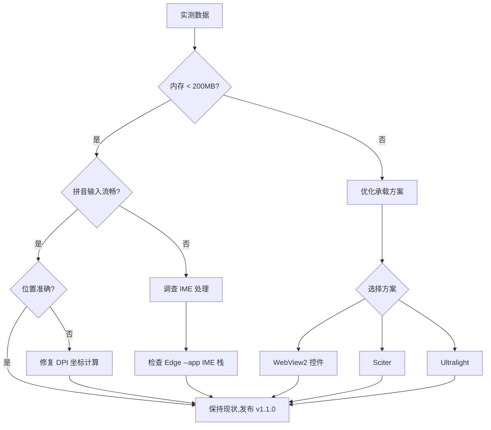

# HD2 Chat Overlay v1.1.0 实测指南

## 测试目标

收集 Edge --app 模式下的实际性能数据，评估是否需要优化承载方案（WebView2 控件 / Sciter / Ultralight）。

---

## 测试环境准备

1. **确保脚本可运行**
   - 双击 `hd2_chat.ahk` 启动（WebView2 模式）
   - 或双击 `hd2_chat_native.ahk` 启动（原生模式，用于对比）

2. **开启调试日志**
   - 托盘图标右键 -> 打开配置窗口 -> 勾选 "启用调试日志" -> 保存
   - 日志文件: `hd2_chat_debug.log`

3. **准备测试工具**
   - 任务管理器 (Ctrl+Shift+Esc) -> 详细信息 -> 添加列 "内存(专用工作集)"
   - 或使用 [Process Explorer](https://learn.microsoft.com/en-us/sysinternals/downloads/process-explorer)

---

## 测试场景与数据收集

### 场景 1: 启动与内存占用

| 步骤 | 操作 | 记录项 |
|------|------|--------|
| 1 | 启动 `hd2_chat.ahk` | 托盘是否出现图标 |
| 2 | 等待 10 秒 | 任务管理器中 `AutoHotkey64.exe` 内存 |
| 3 | 托盘右键 -> 打开配置窗口 | 是否弹出配置界面 |
| 4 | 等待 5 秒 | 新增 `msedge.exe` 进程数量及各自内存 |
| 5 | 关闭配置窗口 | 记录总内存 (AHK + Edge) |

**对比测试**: 启动 `hd2_chat_native.ahk`，记录原生模式内存。

**预期数据**:
- WebView2 模式: AHK (~5MB) + Edge (~80-150MB) = 总计 ~85-155MB
- 原生模式: AHK (~5MB)

**评估标准**:
- 若总内存 < 200MB: 可接受，无需优化
- 若总内存 > 250MB: 建议优化承载方案

---

### 场景 2: 悬浮窗唤醒与输入流畅度

| 步骤 | 操作 | 记录项 |
|------|------|--------|
| 1 | 开启全局测试模式 | 托盘 -> 勾选 "🧪 全局测试模式" |
| 2 | 运行 `test/TestWithNotepad.ahk` | 记事本启动 |
| 3 | 在记事本窗口按 Enter | 悬浮窗是否弹出，弹出延迟 |
| 4 | 输入拼音 "nihao" 观察候选框 | 是否流畅，有无卡顿 |
| 5 | 继续输入长拼音 (如 "zhonghuarenmingongheguo") | 文本越长是否越卡 |
| 6 | 按 Enter 发送 | 文本是否正确注入记事本 |
| 7 | 重复 3-6 步骤 5 次 | 稳定性 |

**对比测试**: 在原生模式下重复上述步骤。

**预期数据**:
- WebView2 模式: 唤醒延迟 < 200ms，拼音输入全程流畅
- 原生模式: 唤醒延迟 < 50ms，但长文本拼音可能出现卡顿

**评估标准**:
- 若 WebView2 模式拼音输入全程无卡顿: 核心问题解决，无需优化 IME
- 若仍有卡顿: 需进一步调查 (可能是 Edge --app 的 IME 处理仍不够优)

---

### 场景 3: 位置准确性与 DPI

| 步骤 | 操作 | 记录项 |
|------|------|--------|
| 1 | 在 1080p 100% DPI 下测试 | 悬浮窗是否紧贴记事本右下角 |
| 2 | 系统设置改为 125% DPI，重启脚本 | 位置是否仍准确 |
| 3 | 多显示器环境 (如 100% + 150%) | 拖动记事本到另一显示器，按 Enter 测试 |
| 4 | 使用 Ctrl+Alt+方向键微调 | 位置是否实时跟随，保存后重启是否保持 |

**评估标准**:
- 若所有 DPI 下位置准确: DPI 方案有效
- 若偏移 > 10px: 需调整坐标计算逻辑

---

### 场景 4: 配置界面可用性

| 步骤 | 操作 | 记录项 |
|------|------|--------|
| 1 | 打开配置窗口 | 所有控件是否可见，有无遮挡 |
| 2 | 修改字体大小 | 悬浮窗是否实时预览 |
| 3 | 修改 OffsetX/OffsetY | 悬浮窗是否实时移动 |
| 4 | 点击保存 | 配置是否持久化，悬浮窗是否重建 |
| 5 | 点击取消 | 修改是否回滚 |
| 6 | 调整配置窗口大小 | 布局是否自适应，无滚动条异常 |

**评估标准**:
- 若实时预览正常: 配置绑定有效
- 若布局错乱: 需修复 CSS

---

### 场景 5: 降级与回滚

| 步骤 | 操作 | 记录项 |
|------|------|--------|
| 1 | 托盘 -> 切换到原生控件 | 脚本是否重启，原生模式是否正常 |
| 2 | 托盘 -> 切换到 WebView2 | 是否恢复 WebView2 模式 |
| 3 | 修改配置并保存 | `.bak` 文件是否生成 |
| 4 | 托盘 -> 回滚到上一版本配置 | 配置是否恢复，脚本是否重启 |
| 5 | 删除 `hd2_chat_settings.ini` 后启动 | 是否使用默认配置 |

**评估标准**:
- 若降级/回滚均正常: 兼容机制可靠

---

## 数据记录模板

测试完成后，请填写以下数据：

```markdown
## 实测数据记录

### 环境信息
- OS: Windows 11 23H2
- 显示器: 1920x1080 100% DPI (主), 2560x1440 125% DPI (副)
- Edge 版本: 
- WebView2 Runtime 版本: 

### 内存占用 (MB)
| 模式 | AHK 进程 | Edge 进程(总) | 总计 |
|------|----------|---------------|------|
| WebView2 | | | |
| 原生 | | | |

### 输入流畅度 (1-5 分, 5 最流畅)
| 模式 | 短文本 (<10 字) | 长文本 (>50 字) | 拼音候选框响应 |
|------|----------------|-----------------|---------------|
| WebView2 | | | |
| 原生 | | | |

### 位置准确性
| DPI | 偏移量 (px) | 是否可接受 |
|-----|-------------|-----------|
| 100% | | |
| 125% | | |
| 150% | | |

### 稳定性
- 连续唤醒/关闭 10 次: 成功 / 失败
- 配置保存/取消 5 次: 成功 / 失败
- 引擎切换 3 次: 成功 / 失败

### 主观评价
- 最满意的功能: 
- 最不满意的问题: 
- 是否建议优化承载方案: 是 / 否 / 无所谓
```

---

## 后续决策路径

根据实测数据，按以下路径决策：



---

## 常见问题速查

| 问题 | 快速解决 |
|------|----------|
| 脚本无法启动 | 以管理员身份运行，或检查杀毒软件拦截 |
| 悬浮窗不弹出 | 确认已开启全局测试模式，或在游戏窗口内按 Enter |
| Edge 进程残留 | 托盘 -> 退出，或任务管理器结束 `msedge.exe` |
| 配置窗口空白 | 检查 `ui/config/` 文件是否存在，或查看日志 |
| 拼音无候选框 | 确认系统输入法已切换为中文，或尝试微软拼音 |

更多问题请参考 `docs/TROUBLESHOOTING.md`
