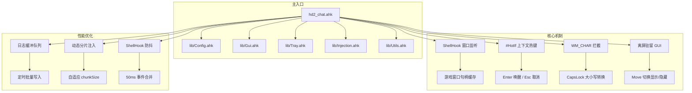

# HD2 Chat Overlay - AHK 主干迭代计划

## 背景与决策

基于对比分析,AHK 版本在核心体验(IME 处理、窗口驻留、多显示器、热键响应)上优于 C# WPF 版本。
**决策**: 以 AHK 为主干继续迭代,C# 项目封存至 `../HD2ChatOverlay_CSharp_Archive/`。

## 目标架构



## 阶段详情

### 阶段 1: 项目封存与 Git 初始化

| 任务 | 说明 | 产出 |
|------|------|------|
| 1.1 移动 C# 项目 | 将 `App.xaml`, `App.xaml.cs`, `HD2ChatOverlay.csproj`, `app.manifest`, `Native/`, `Services/`, `Views/`, `bin/`, `obj/` 移动到 `../HD2ChatOverlay_CSharp_Archive/` | 当前目录仅保留 AHK 相关文件 |
| 1.2 Git 初始化 | `git init`,创建 `.gitignore` 排除 `*.log`, `*.ini`, `tmp/`, `*.tmp` | `.git/`, `.gitignore` |
| 1.3 初始提交 | `git add hd2_chat.ahk`,提交信息: `chore: initial commit from legacy AHK script` | 首个 commit |

### 阶段 2: AHK 工程化增强

| 任务 | 说明 | 关键实现 |
|------|------|---------|
| 2.1 托盘菜单 | 使用 `A_TrayMenu` 构建层级菜单 | 显示配置窗口、全局测试模式(Check)、位置调整模式、分隔线、关于、退出 |
| 2.2 配置 GUI | 纯 AHK `Gui()` 窗口,非模态 | 输入框: OffsetX, OffsetY, ChunkSize, ChunkDelay;复选框: EnableDebugLog, GlobalTestMode;下拉框: FontName(开销小的字体: SimHei/Microsoft YaHei UI/Segoe UI);按钮: 保存/取消/恢复默认 |
| 2.3 配置持久化 | 扩展 INI 读写 | `[Coordinates]` OffsetX/OffsetY;`[Injection]` ChunkSize/ChunkDelay;`[Debug]` EnableDebugLog;`[Mode]` GlobalTestMode |
| 2.4 单实例锁 | 防止多开 | `DllCall("CreateMutex", ...)` 或锁文件,检测到已运行时弹窗提示并退出 |

### 阶段 3: 性能优化

| 任务 | 当前问题 | 优化方案 |
|------|---------|---------|
| 3.1 游戏窗口句柄缓存 | `WinExist("ahk_exe helldivers2.exe")` 在热键、提交、调整位置时频繁调用 | 全局 `g_cachedGameHwnd`,ShellHook 事件时刷新,调用前检查 `WinExist("ahk_id " g_cachedGameHwnd)` 有效性 |
| 3.2 ShellHook 防抖 | 窗口切换时连续触发多次回调 | 记录 `lastShellEventTime`,50ms 内相同 `wParam` 合并;状态未变化时直接返回 |
| 3.3 日志缓冲批量写入 | 每次 `FileAppend` 都打开/关闭文件 | 内存数组 `g_logQueue`,`SetTimer` 每 500ms 或满 10 条时批量 `FileAppend` |
| 3.4 动态分片注入 | 固定 8 字符 + 5ms,长文本总延迟高 | 根据 `StrLen` 自适应: <=8 不分片;<=32 用 16 字符/3ms;>32 用 32 字符/2ms |

### 阶段 4: 代码结构重构

| 任务 | 说明 |
|------|------|
| 4.1 多文件拆分 | `hd2_chat.ahk` 主入口(热键、ShellHook、主流程);`lib/Config.ahk`(INI 读写、配置 GUI);`lib/Gui.ahk`(悬浮窗创建、显示/隐藏、位置计算);`lib/Tray.ahk`(托盘菜单);`lib/Injection.ahk`(文本注入、按键模拟);`lib/Utils.ahk`(日志、IME 控制、Win32 封装) |
| 4.2 统一错误处理 | 关键 Win32 调用封装 `SafeWin32Call()`,失败时写入日志并返回默认值 |
| 4.3 版本号 | 脚本顶部 `global SCRIPT_VERSION := "1.0.0"`,托盘菜单"关于"显示 |

### 阶段 5: 测试与文档

| 任务 | 说明 |
|------|------|
| 5.1 测试脚本 | `test/TestWithNotepad.ahk`: 启动 Notepad 模拟游戏窗口,验证 Enter 唤醒、输入、提交、Esc 取消、位置调整 |
| 5.2 README.md | 项目简介、功能特性、快捷键表、配置项说明、运行方式、日志查看 |
| 5.3 提交规范 | 约定式提交: `feat:` 新功能, `fix:` 修复, `perf:` 性能优化, `refactor:` 重构, `docs:` 文档, `chore:` 构建/工具 |

## 文件结构(目标)

```
e:/Games/HD2ChatOverlay/
├── .git/
├── .gitignore
├── README.md
├── hd2_chat.ahk          ; 主入口
├── hd2_chat_settings.ini ; 运行时生成
├── hd2_chat_debug.log    ; 运行时生成
├── lib/
│   ├── Config.ahk
│   ├── Gui.ahk
│   ├── Tray.ahk
│   ├── Injection.ahk
│   └── Utils.ahk
├── test/
│   └── TestWithNotepad.ahk
└── plans/
    └── ahk-refactor-plan.md
```

## 风险与缓解

| 风险 | 缓解 |
|------|------|
| 多文件拆分后 `#Include` 路径问题 | 使用 `#Include %A_ScriptDir%\lib\*.ahk`,主入口统一引用 |
| 配置 GUI 与主 GUI 焦点冲突 | 配置窗口打开时暂停 ShellHook 处理,关闭后恢复 |
| 句柄缓存失效(游戏重启) | 每次使用前 `WinExist("ahk_id " hwnd)` 验证,失效则重新查找 |
| 日志缓冲在脚本退出时丢失 | `OnExit` 时强制 flush 剩余日志 |
