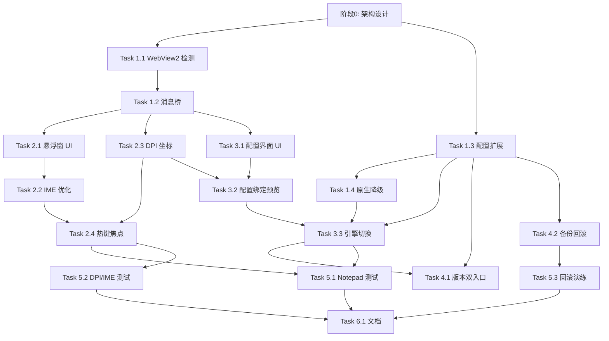

# WebView2 重构任务拆解

## 阶段 0: 架构设计文档 ✅

- [x] 编写 `plans/webview2-refactor-plan.md`

---

## 阶段 1: 基础设施与兼容层

### Task 1.1: WebView2 Runtime 检测与自动安装

**描述**: 在 `lib/WebView2Host.ahk` 中实现 Runtime 检测，未安装时通过 Evergreen Bootstrapper 静默下载安装，失败时优雅降级。

**验收标准**:
- [ ] 能准确检测 WebView2 Runtime 是否安装（注册表 + DLL 路径）
- [ ] 未安装时自动下载 Bootstrapper 并静默安装
- [ ] 安装失败时返回 `false` 并记录日志
- [ ] 用户取消安装时返回 `false` 不崩溃

**验证**:
- [ ] 在干净 Windows 沙盒/虚拟机中测试自动安装
- [ ] 断网环境下测试降级路径

**依赖**: None

**文件**:
- `lib/WebView2Host.ahk` (新建)
- `lib/Utils.ahk` (扩展: 注册表读取、下载辅助)

**范围**: S

---

### Task 1.2: WebView2 环境初始化与 AHK 消息桥

**描述**: 封装 WebView2 的 `CoreWebView2Environment` 创建，实现 `PostMessage` 双向通信，将 AHK 函数暴露为 HostObject 供 JS 调用。

**验收标准**:
- [ ] 成功创建 WebView2 环境并附加到 AHK 窗口
- [ ] JS 可通过 `window.chrome.webview.postMessage` 发送消息，AHK 通过 `WebView2HostInstance.OnMessage` 接收
- [ ] JS 可通过 `window.chrome.webview.hostObjects` 调用 AHK 函数（如 `ahk.submit(text)`）
- [ ] 消息序列化/反序列化使用 JSON，异常不崩溃

**验证**:
- [ ] 最小 HTML 页面可双向通信
- [ ] 高频消息（100次/秒）无丢失或泄漏

**依赖**: Task 1.1

**文件**:
- `lib/WebView2Host.ahk`

**范围**: M

---

### Task 1.3: 配置系统扩展与迁移

**描述**: 扩展 `AppConfig` 支持 `UseWebView2` 开关、`BackupCount` 等；实现 INI 自动备份；提供配置迁移逻辑（旧版本 INI 升级）。

**验收标准**:
- [ ] 新增配置项: `UseWebView2` (默认 1), `BackupCount` (默认 3)
- [ ] 每次 `Save()` 前自动备份到 `.bak`, `.bak.1`, `.bak.2` 滚动
- [ ] 旧版本 INI 缺少新键时自动填充默认值
- [ ] 配置读写异常时记录日志不崩溃

**验证**:
- [ ] 删除 INI 后启动，自动生成默认配置
- [ ] 手动修改 `UseWebView2=0`，重启后生效

**依赖**: None

**文件**:
- `lib/Config.ahk`
- `lib/Utils.ahk` (扩展: 文件复制、版本比较)

**范围**: S

---

### Task 1.4: 原生控件降级路径封装

**描述**: 将现有 `Gui.ahk` 中的原生悬浮窗和配置窗口拆分为 `Gui.Native.ahk` / `ConfigGui.Native.ahk`，作为 WebView2 不可用时的降级实现。

**验收标准**:
- [ ] `Gui.ahk` 变为门面，根据 `AppConfig.UseWebView2` 路由到 WebView2 或 Native
- [ ] 原生悬浮窗/配置窗口功能与现有版本完全一致
- [ ] 降级路径切换无需重启（提示用户重启后生效）

**验证**:
- [ ] `UseWebView2=0` 时所有功能正常
- [ ] 与 WebView2 模式的热键行为一致

**依赖**: Task 1.3

**文件**:
- `lib/Gui.ahk` (重构为门面)
- `lib/Gui.Native.ahk` (新建, 从 Gui.ahk 拆分)
- `lib/ConfigGui.Native.ahk` (新建, 从 Gui.ahk 拆分)

**范围**: M

---

### 检查点: 阶段 1 完成

- [ ] WebView2 环境可初始化，消息桥可通信
- [ ] 配置系统支持备份/回滚
- [ ] 原生降级路径完整可用

---

## 阶段 2: 悬浮窗 WebView2 重构

### Task 2.1: 悬浮窗 HTML/CSS UI 实现

**描述**: 创建 `ui/overlay/` 三件套，实现现代化输入框：暗色主题、圆角、阴影、内边距、发送按钮图标、自适应高度。

**验收标准**:
- [ ] 视觉风格与 HD2 游戏 UI 协调（深色、高对比、无衬线字体）
- [ ] 输入框支持多行自动增高（最多 4 行，超出滚动）
- [ ] 有明确的聚焦态（边框高亮）和占位符提示
- [ ] 包含发送按钮（图标 + 快捷键提示 Enter）

**验证**:
- [ ] 在浏览器直接打开 `index.html` 可预览样式
- [ ] 长文本换行显示正常

**依赖**: None

**文件**:
- `ui/overlay/index.html`
- `ui/overlay/overlay.css`
- `ui/overlay/overlay.js`

**范围**: M

---

### Task 2.2: IME 组合事件处理与拼音卡顿优化

**描述**: 在 `overlay.js` 中处理 `compositionstart/update/end`，确保 IME 组合期间不触发 AHK 的 `submit`，仅在组合结束后发送完整文本。

**验收标准**:
- [ ] 拼音输入过程中不触发 `submit`
- [ ] 按 Enter 时，若处于组合状态则先提交组合，再发送文本
- [ ] 输入 200+ 字符拼音无卡顿，候选框响应即时
- [ ] 与 AHK 的 `WM_CHAR` 拦截无冲突

**验证**:
- [ ] 使用微软拼音/搜狗输入法测试长文本
- [ ] 日志确认 `submit` 仅在组合结束后触发一次

**依赖**: Task 1.2, Task 2.1

**文件**:
- `ui/overlay/overlay.js`
- `lib/WebView2Host.ahk`

**范围**: M

---

### Task 2.3: DPI 感知与坐标系统一

**描述**: 实现 `PerMonitorV2` DPI 感知，处理 `WM_DPICHANGED`，将 OffsetX/OffsetY 从逻辑像素转换为物理像素，确保跨显示器位置准确。

**验收标准**:
- [ ] 在 100% / 125% / 150% / 200% DPI 下，悬浮窗位置与游戏右下角对齐
- [ ] 跨显示器拖动游戏窗口后，悬浮窗位置自动适配
- [ ] `Ctrl+Alt+方向键` 调整位置时，保存的是逻辑像素，重启后位置一致

**验证**:
- [ ] 多显示器（不同 DPI）环境测试
- [ ] 修改系统缩放后重启脚本验证

**依赖**: Task 1.2

**文件**:
- `lib/WebView2Host.ahk`
- `lib/Utils.ahk` (扩展: DPI 辅助函数)
- `lib/Gui.ahk`

**范围**: M

---

### Task 2.4: 热键绑定与焦点管理

**描述**: 确保 Enter/Esc/滚轮等热键在 WebView2 模式下正常工作，焦点在 AHK 窗口与 WebView2 之间正确传递。

**验收标准**:
- [ ] 游戏内按 Enter 唤醒悬浮窗，焦点自动进入 WebView2 输入框
- [ ] 悬浮窗激活时按 Enter 提交，Esc 取消
- [ ] 滚轮/PgUp/PgDn 转发到游戏（不拦截 WebView2 内部滚动）
- [ ] 点击悬浮窗外部时自动关闭并返回游戏焦点

**验证**:
- [ ] 与原生模式的热键行为完全一致
- [ ] 焦点切换时无闪烁或丢失

**依赖**: Task 2.2, Task 2.3

**文件**:
- `hd2_chat.ahk`
- `lib/Gui.ahk`
- `lib/WebView2Host.ahk`

**范围**: M

---

### 检查点: 阶段 2 完成

- [ ] 悬浮窗在 WebView2 模式下功能完整，拼音输入无卡顿
- [ ] DPI 多显示器位置准确
- [ ] 热键行为与原生模式一致

---

## 阶段 3: 配置界面 WebView2 重构

### Task 3.1: 配置界面 HTML/CSS 布局

**描述**: 创建 `ui/config/` 三件套，使用 CSS Grid 实现两栏响应式布局，分组卡片式展示，彻底解决遮挡。

**验收标准**:
- [ ] 所有配置项清晰可见，无重叠/截断
- [ ] 窗口最小宽度 480px，可拖拽调整大小，内容自适应
- [ ] 分组标题（窗口位置 / 文本注入 / 字体 / 调试 / 引擎）有视觉层级
- [ ] 数字输入框带加减按钮，下拉框样式统一

**验证**:
- [ ] 浏览器直接打开 `index.html` 可预览
- [ ] 调整窗口大小无布局错乱

**依赖**: None

**文件**:
- `ui/config/index.html`
- `ui/config/config.css`
- `ui/config/config.js`

**范围**: M

---

### Task 3.2: 配置绑定与实时预览

**描述**: 实现配置项与 AHK 的双向绑定，修改字体/偏移时实时发送到悬浮窗预览，保存时持久化到 INI。

**验收标准**:
- [ ] 页面加载时从 AHK 拉取当前配置并填充表单
- [ ] 修改字体名称/大小时，悬浮窗立即应用新样式（无需保存）
- [ ] 修改 OffsetX/OffsetY 时，悬浮窗立即移动到新位置
- [ ] 点击"保存"后写入 INI，点击"取消"恢复原值

**验证**:
- [ ] 预览修改后取消，悬浮窗恢复原状
- [ ] 保存后重启脚本，配置保持

**依赖**: Task 1.2, Task 2.3, Task 3.1

**文件**:
- `ui/config/config.js`
- `lib/WebView2Host.ahk`
- `lib/Config.ahk`

**范围**: M

---

### Task 3.3: 引擎切换与降级入口

**描述**: 在配置界面提供"渲染引擎"选择（WebView2 / 原生控件），切换后提示重启，并处理 WebView2 初始化失败的自动降级。

**验收标准**:
- [ ] 下拉框显示当前引擎，切换后保存到 `UseWebView2`
- [ ] 提示"重启后生效"，重启后正确加载对应引擎
- [ ] WebView2 连续初始化失败 3 次后，自动写入 `UseWebView2=0` 并弹窗提示已降级

**验证**:
- [ ] 模拟 WebView2 初始化失败，验证自动降级
- [ ] 手动切换引擎后功能正常

**依赖**: Task 1.3, Task 1.4, Task 3.2

**文件**:
- `ui/config/config.js`
- `lib/Config.ahk`
- `lib/WebView2Host.ahk`
- `lib/Tray.ahk`

**范围**: S

---

### 检查点: 阶段 3 完成

- [ ] 配置界面现代化、无遮挡、支持实时预览
- [ ] 引擎切换与降级机制可靠

---

## 阶段 4: 版本管理与回滚机制

### Task 4.1: 版本号与发布双入口

**描述**: 将主版本号升级为 `1.1.0`，提供 `hd2_chat.ahk`（WebView2 默认）和 `hd2_chat_native.ahk`（纯原生）双入口。

**验收标准**:
- [ ] `Tray.ahk` 中 `SCRIPT_VERSION` 更新为 `1.1.0`
- [ ] `hd2_chat_native.ahk` 强制 `UseWebView2=0` 并隐藏引擎切换入口
- [ ] 关于对话框显示当前渲染引擎

**验证**:
- [ ] 两个入口均可独立运行
- [ ] 版本号在托盘提示和关于中正确显示

**依赖**: Task 1.3, Task 3.3

**文件**:
- `lib/Tray.ahk`
- `hd2_chat.ahk`
- `hd2_chat_native.ahk` (新建)

**范围**: S

---

### Task 4.2: 配置备份与一键回滚

**描述**: 在托盘菜单添加"回滚到上一版本配置"，恢复最新 `.bak` 并重启；记录更新日志到 `CHANGELOG.md`。

**验收标准**:
- [ ] 托盘菜单新增 `🔄 回滚配置`，恢复 `.bak` 并 `Reload()`
- [ ] 无 `.bak` 时菜单项禁用
- [ ] 每次版本升级时，在 `CHANGELOG.md` 记录变更

**验证**:
- [ ] 修改配置后回滚，恢复旧值
- [ ] 回滚后脚本自动重启

**依赖**: Task 1.3

**文件**:
- `lib/Tray.ahk`
- `lib/Config.ahk`
- `CHANGELOG.md` (新建)

**范围**: S

---

### 检查点: 阶段 4 完成

- [ ] 版本号、双入口、回滚机制完整

---

## 阶段 5: 测试与验证

### Task 5.1: Notepad 模拟集成测试

**描述**: 扩展 `test/TestWithNotepad.ahk`，验证 WebView2 模式下 Enter 唤醒、中文输入、提交、Esc 取消、位置调整全流程。

**验收标准**:
- [ ] 测试脚本可自动/半自动完成上述流程
- [ ] WebView2 模式与原生模式结果一致
- [ ] 测试失败时输出明确错误信息

**验证**:
- [ ] 在干净环境运行测试通过

**依赖**: 阶段 2, 3 完成

**文件**:
- `test/TestWithNotepad.ahk`
- `test/TestWebView2.ahk` (新建)

**范围**: M

---

### Task 5.2: DPI 多显示器与 IME 压力测试

**描述**: 在 100%/125%/150%/200% DPI、单/多显示器环境下测试位置准确性；使用微软拼音/搜狗输入法输入 500+ 字符测试卡顿。

**验收标准**:
- [ ] 所有 DPI 下位置无偏移
- [ ] 长文本拼音输入流畅，无 UI 线程阻塞

**验证**:
- [ ] 人工测试 + 日志时间戳分析

**依赖**: 阶段 2, 3 完成

**文件**:
- 无代码文件，测试报告写入 `docs/TEST_REPORT.md`

**范围**: M

---

### Task 5.3: 回滚与降级演练

**描述**: 模拟 WebView2 初始化失败、配置损坏、用户手动降级等场景，验证系统行为。

**验收标准**:
- [ ] WebView2 缺失时自动降级，功能完整
- [ ] 配置损坏时恢复默认或最近备份
- [ ] 手动切换引擎后系统稳定

**验证**:
- [ ] 沙盒/虚拟机演练通过

**依赖**: 阶段 1, 4 完成

**文件**:
- 无代码文件，演练记录写入 `docs/TEST_REPORT.md`

**范围**: S

---

### 检查点: 阶段 5 完成

- [ ] 所有测试通过，无阻塞性 Bug

---

## 阶段 6: 文档更新

### Task 6.1: README 与故障排查指南

**描述**: 更新 `README.md` 反映新架构、快捷键、配置项；编写 `docs/TROUBLESHOOTING.md` 覆盖 WebView2 安装失败、降级、DPI 问题等。

**验收标准**:
- [ ] README 包含 WebView2 系统要求、安装说明、双模式切换
- [ ] TROUBLESHOOTING 包含至少 5 个常见问题及解决方案
- [ ] 架构图更新为 WebView2 版本

**验证**:
- [ ] 新用户可按 README 完成安装
- [ ] 问题排查指南可解决模拟故障

**依赖**: 阶段 1-5 完成

**文件**:
- `README.md`
- `docs/TROUBLESHOOTING.md`
- `plans/webview2-refactor-plan.md` (更新为完成状态)

**范围**: M

---

### 检查点: 阶段 6 完成

- [ ] 文档完整，可发布 v1.1.0

---

## 依赖关系图

