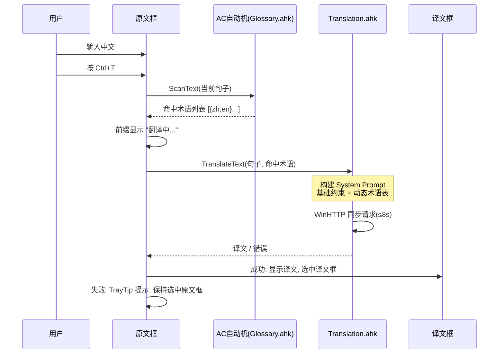
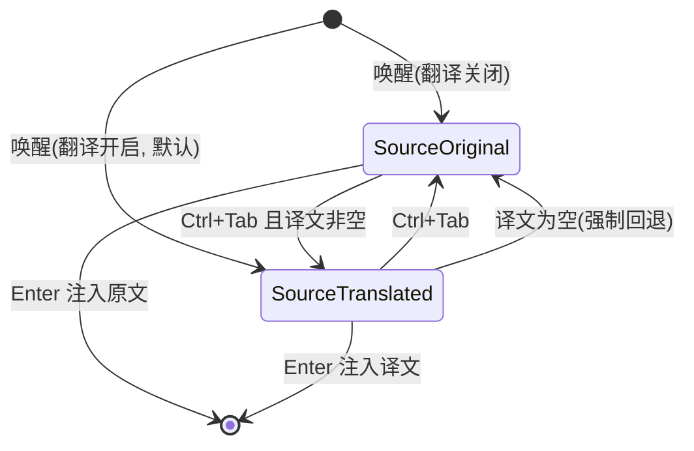

# Spec: HD2 Chat Overlay - AI 双悬浮框翻译功能

> **状态**: 已评审，待实施
> **版本**: 1.1（术语源已确认：免爬虫社区 JSON + 可选 Wiki 对照；快捷键支持 INI 自定义）
> **前置**: 工作区已存在单悬浮框翻译实现（[`lib/Translation.ahk`](../lib/Translation.ahk) 网络层 + 配置 + 提交时同步替换），本 Spec 在其基础上**重构为双悬浮框架构**并新增**术语管线**。

---

## 1. Objective（目标）

为《绝地潜兵 2》中文输入悬浮窗增加 AI 翻译能力，使玩家可以：

1. 在**原文悬浮框**输入中文，按翻译快捷键（`Ctrl+T`）后，**翻译悬浮框**（位于原文框正上方）显示英文译文，原文保留不动。
2. 通过**注入源选择快捷键**（`Ctrl+Tab`）在两个悬浮框之间切换选中态（视觉高亮），按 `Enter` 将**当前选中框**的内容注入游戏。未开翻译时仅原文框，直接注入。
3. 在配置面板输入 OpenAI 兼容 API（Base/Key/模型），默认模型 `google/gemini-2.5-flash`（低延迟、低成本、性能够用）。
4. 通过**术语管线**解决游戏黑话/专业术语翻译问题：本地 AC 自动机预扫描当前句子，提取命中的 HD2 术语，动态注入 System Prompt 约束模型输出。

**成功标准（Success Criteria）**：
- SC-1: 开启翻译开关后，唤醒悬浮窗时显示上下两个框（译文框在上，原文框在下），间距 6px，同宽。
- SC-2: `Ctrl+T` 触发翻译期间，原文框内容可继续编辑不被清空；译文返回后显示在译文框，原文框内容不变。
- SC-3: `Ctrl+Tab` 切换选中框，选中框左侧边条高亮（原文框 `#FFC800` / 译文框 `#4A9EFF`），未选中框边条变暗 40%。
- SC-4: 按 `Enter` 注入的文本 = 当前选中框文本；译文框为空时自动回退注入原文框。
- SC-5: 输入包含 "虫巢爆发" 时，译文输出 "bug breach" 而非 "insect nest explosion"（术语命中率 ≥ 90%，通过内置测试集验证）。
- SC-6: 关闭翻译开关后，行为与现有版本完全一致（单框、Enter 直接注入）。
- SC-7: 翻译请求期间（≤8s 超时），AHK 主线程可接受阻塞（用户已确认当前同步体验流畅），但阻塞期间 GUI 需显示 "翻译中..." 状态。

---

## 2. Tech Stack（技术栈）

| 层 | 技术 | 说明 |
|---|---|---|
| 主程序 | AutoHotkey v2.0+ | 纯原生 GUI，无 WebView2 |
| HTTP | `WinHttp.WinHttpRequest.5.1` COM | 已验证，同步请求（用户确认可接受） |
| API 格式 | OpenAI 兼容 `POST /v1/chat/completions` | 兼容 OpenRouter / DeepSeek / 智谱 / Ollama |
| 术语匹配 | AC 自动机（Aho-Corasick），AHK 原生实现 | O(n) 单遍扫描，n=句长 |
| 术语采集（离线） | Python 3 脚本（一次性/定期运行） | **免爬虫**：直接拉取社区开源 JSON；可选 Wiki 对照补充中文 |
| 术语分发 | GitHub Raw / jsDelivr CDN 托管 `glossary.json` | 版本化、热更新 |

---

## 3. Commands（命令）

```bat
; 运行主程序
AutoHotkey64.exe hd2_chat.ahk

; 术语采集（离线，免爬虫拉取社区 JSON + 可选 Wiki 对照，生成 glossary.core.json）
python tools\glossary_scraper.py --out assets\glossary.core.json
python tools\glossary_scraper.py --with-wiki-zh   ; 可选：补充中文对照

; 测试（记事本注入回归）
AutoHotkey64.exe test\TestWithNotepad.ahk
```

---

## 4. Project Structure（新增/修改）

```
hd2_chat.ahk                  ; 修改: 新增 Ctrl+T / Ctrl+Tab 热键
lib/
  Config.ahk                  ; 修改: [Translation] 增加术语配置项
  Translation.ahk             ; 修改: TranslateText 支持术语注入参数
  Glossary.ahk                ; 新增: AC自动机 + 词库加载 + 热更新下载
  Gui.Native.ahk              ; 修改: 新增翻译悬浮窗（第二个 GUI）
  Gui.ahk                     ; 修改: 注入源选择状态机
  Injection.ahk               ; 修改: SubmitText 按选中框注入
  ConfigGui.Native.ahk        ; 修改: 术语更新按钮/状态/模型预设
assets/
  glossary.core.json          ; 新增: 内置核心术语库（随发布打包）
tools/
  glossary_scraper.py         ; 新增: Wiki/社区JSON 爬虫（离线）
plans/
  translation-spec.md         ; 本文件
```

---

## 5. 架构设计

### 5.1 双悬浮框布局

```
┌────────────────────────────────────────────┐ ← 译文框 (y = 主框Y - 58 - 6)
│▌🌐 [EN]  translated text...                │   边条 #4A9EFF (淡蓝)
├────────────────────────────────────────────┤
│▌💬 [中]  原始中文输入框                     │ ← 原文框 (现有, 边条 #FFC800)
└────────────────────────────────────────────┘
```

- 译文框为**只读 Edit 控件**（`+ReadOnly`），防止误编辑；高度与原文框一致（`OverlayHeight`），宽度同 `OverlayWidth`。
- 译文框随主框一起显示/隐藏/移动，[`AdjustGuiPos()`](../lib/Gui.ahk:185) 需同步移动两个框。
- 选中态：选中框边条 Progress 控件 `Background` 保持亮色；未选中框边条通过 `GuiControl` 改为暗色（`Opt("+Background" dimColor)`）。

### 5.2 翻译工作流（同步，保留现有体验）



### 5.3 注入源选择状态机



全局变量 `g_injectSource`（`"original"` / `"translated"`），[`SubmitText()`](../lib/Injection.ahk:32) 据此取对应框文本。

### 5.4 术语管线（三层，免爬虫优先）

```
┌──────────────────────────────────────────────────────────┐
│ 层1 采集(离线): tools/glossary_scraper.py                 │
│   主源(免爬虫, 英文原名):                                   │
│   - helldivers-2/json GitHub 仓库 (items/factions/        │
│     planets 等官方拆包静态数据, 定期 HTTP Fetch)            │
│   - api.helldivers2.dev Community REST API (SwaggerUI)    │
│   可选对照源(补充中文):                                     │
│   - Fandom 英文 Wiki: Enemies/Stratagems/Weapons 分类页   │
│   - zh.wikipedia.org 绝地潜兵2 (中文译名对照)              │
│   抓取范围(高频战场词优先):                                 │
│     战术配备 / 敌人名称 / 武器装备 / 战术行为动词与简写      │
│     任务类型仅抓动词/简写                                   │
│   输出: assets/glossary.core.json (中英对照+别名+分类)      │
├──────────────────────────────────────────────────────────┤
│ 层2 分发(热更新): GitHub Raw / jsDelivr                    │
│   - glossary.json 含 version 字段                          │
│   - 启动时/配置面板手动触发: 比对版本 → 下载覆盖             │
├──────────────────────────────────────────────────────────┤
│ 层3 运行时: lib/Glossary.ahk                               │
│   - 加载 JSON → 构建 AC 自动机 (Trie + fail指针)           │
│   - ScanText(句子) → 命中术语子集                          │
│   - 注入 System Prompt: "术语映射: 虫巢=bug, ..."          │
└──────────────────────────────────────────────────────────┘
```

**术语源明细**：

| 源 | 类型 | 用途 | 更新方式 |
|---|---|---|---|
| `github.com/helldivers-2/json` | 官方拆包静态 JSON | 英文原名主源（items/factions/planets） | 定期 HTTP Fetch / Git Submodule |
| `api.helldivers2.dev` | Community REST API | 最新游戏实体 JSON（SwaggerUI） | 定期 HTTP Fetch |
| `helldivers.fandom.com` | 英文 Wiki | 英文原名权威对照（Enemies/Stratagems/Weapons 分类页） | 可选爬虫 |
| `zh.wikipedia.org/wiki/绝地潜兵2` | 中文维基 | 中文译名对照 | 可选爬虫 |

**抓取范围（高频战场词优先）**：战术配备（Stratagems）、敌人名称（Enemies）、武器装备（Weapons）、战术行为动词/简写（如 extract/resupply/reinforce）；任务类型仅抓动词与简写，不抓长描述。

**glossary.json 格式**：

```json
{
  "version": "2026.07.30",
  "terms": [
    { "zh": "虫巢", "en": "bug nest", "aliases": ["虫穴"], "category": "enemy" },
    { "zh": "机器人", "en": "bot", "aliases": ["机械人"], "category": "faction" },
    { "zh": "撤离", "en": "extract", "aliases": ["撤退"], "category": "action" }
  ]
}
```

**AC 自动机性能预算**：词库规模 ≤ 500 词；句长 ≤ 200 字符；单遍扫描 < 1ms（AHK 原生循环，Trie 用 Map 嵌套实现）。构建耗时 < 50ms（启动时一次）。

---

## 6. Code Style（代码风格）

遵循现有项目约定（参考 [`lib/Translation.ahk`](../lib/Translation.ahk)）：

```ahk
; 类静态方法 + 详细注释分节
class Glossary {
    static trieRoot := Map()

    ; -------------------------------------------------------------
    ; 加载词库并构建 AC 自动机
    ; -------------------------------------------------------------
    static Load(jsonPath) {
        ; ...
    }
}
```

- 全局变量加前缀（`g_` / `native` 已有约定）
- 所有网络操作 try/catch 包裹，失败不崩溃，TrayTip 提示
- 日志走 [`WriteLog()`](../lib/Utils.ahk:9)，前缀 `[Glossary]` / `[Translation]`

---

## 7. Testing Strategy（测试策略）

| 层级 | 内容 | 工具 |
|---|---|---|
| 术语单元测试 | 内置 20 句测试集（含黑话），断言 AC 命中与译文包含目标英文词 | AHK 函数，F9 触发自检 |
| 注入回归 | [`test/TestWithNotepad.ahk`](../test/TestWithNotepad.ahk) 验证双框注入不吞字 | 记事本 |
| 手动验收 | SC-1 ~ SC-7 逐条核对 | 游戏内实测 |
| 性能 | 词库构建时间、扫描耗时、内存增量写入日志 | `A_TickCount` + Process 内存 |

---

## 8. Boundaries（边界）

- **Always（总是做）**:
  - 翻译失败时保留原文可注入，绝不静默吞掉用户输入
  - 所有新配置项写入 `[Translation]` INI 节并参与备份/回滚
  - 词库 JSON 解析失败时降级使用 `assets/glossary.core.json`
- **Ask first（先询问）**:
  - 变更默认模型或 API Base
  - 引入新的外部依赖（如 JSON 库）
  - 修改现有单框模式的任何默认行为
- **Never（绝不做）**:
  - 不在日志中记录 ApiKey（脱敏为 `sk-***`）
  - 不在翻译请求中发送 ApiKey 以外的用户隐私数据
  - 不破坏未开翻译时的现有注入路径（SC-6）

---

## 9. 性能开销评估（可行性结论）

| 项目 | 开销 | 评估 |
|---|---|---|
| 新增译文框 GUI | +2~4 MB 内存，1 个窗口句柄 | 🟢 可忽略 |
| AC 自动机构建（500 词） | < 50ms，启动时一次 | 🟢 可忽略 |
| AC 扫描（每次 Ctrl+T） | < 1ms | 🟢 可忽略 |
| 翻译 HTTP（同步阻塞） | 0.5~8s，用户已确认可接受 | 🟡 已知限制，前缀显示"翻译中..." |
| 词库热更新下载 | ~50KB，手动/启动时触发 | 🟢 可忽略 |
| **总体可行性** | — | ✅ **完全可行**，无架构级风险 |

---

## 10. 已确认决策（原 Open Questions）

1. **术语源**：✅ 免爬虫优先 —— 主源 `helldivers-2/json` GitHub 仓库 + `api.helldivers2.dev` Community API；可选 Wiki 对照（Fandom 英文 + zh.wikipedia 中文）。`glossary.json` 热更新托管地址先占位（`https://raw.githubusercontent.com/<user>/HD2ChatOverlay/main/assets/glossary.json`），实施时可替换。
2. **爬虫范围**：✅ 高频战场词优先 —— 战术配备 / 敌人名称 / 武器装备 / 战术行为动词与简写；任务类型仅抓动词/简写。
3. **快捷键自定义**：✅ 允许 INI 自定义 —— `[Hotkeys]` 节新增 `TranslateKey=^t`、`SwitchSourceKey=^Tab`，配置面板提供输入框，注意 UI 排版不挤压现有布局（配置窗口加高或分区滚动）。

---

## 11. 风险与缓解

| 风险 | 影响 | 缓解 |
|---|---|---|
| WinHTTP 同步阻塞期间游戏掉线/卡顿 | 中 | 超时上限 8s；前缀状态提示；失败自动回退原文 |
| 词库 JSON 格式被恶意篡改（CDN） | 低 | 解析失败降级核心库；记录 version 便于回滚 |
| AC 自动机 AHK 实现复杂度高 | 中 | 词库 ≤500 词时可用简化 Trie+逐词扫描降级方案兜底 |
| gemini-2.5-flash 模型名变更 | 低 | 配置面板提供"拉取模型列表"（已实现） |
| 社区 JSON 仓库结构变更 | 低 | 采集脚本内置多路径回退；失败时保留旧版核心库 |
| 快捷键与游戏/系统冲突 | 中 | INI 自定义 + 配置面板冲突检测提示 |
