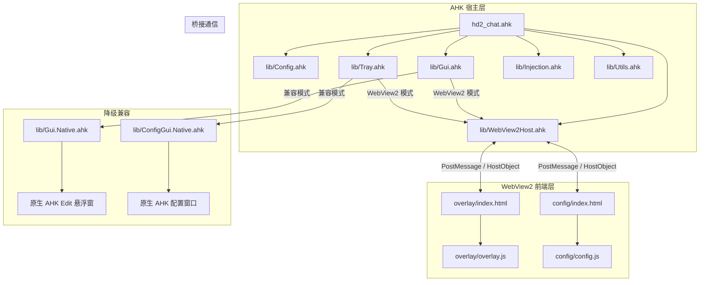
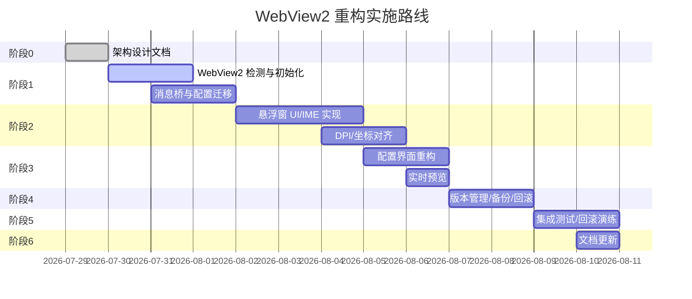

# HD2 Chat Overlay - WebView2 重构架构设计文档

## 1. 背景与决策

### 1.1 现存问题

| 问题 | 根因 | 影响 |
|------|------|------|
| 悬浮框简陋、输入位置偏移 | AHK 原生 `Edit` 控件无现代样式；`-DPIScale` + 硬编码 `w510 h48` 导致 DPI/尺寸失配 | 用户体验差，视觉不统一 |
| 配置界面简陋、功能遮挡 | 绝对坐标布局 + 固定窗口 `w420 h420`，控件堆积溢出 | 可用性差，部分设置不可见 |
| 拼音输入文本越长越卡顿 | Windows 原生 Edit 同步处理 `WM_IME_COMPOSITION`，IME 候选框更新阻塞 UI 线程 | 长文本输入几乎不可用 |

### 1.2 架构决策

**决策**: 悬浮窗与配置界面均迁移至 **WebView2 (Edge Chromium)**，保留纯 AHK 原生控件作为**兼容降级模式**。

**理由**:
- Chromium 的 IME 栈为异步渲染，组合框/候选框由浏览器合成器处理，不阻塞 AHK UI 线程，可根治拼音卡顿。
- HTML/CSS 提供现代化 UI 能力（圆角、阴影、动画、响应式布局），根治界面简陋与遮挡。
- AHK 负责热键、窗口管理、文本注入等系统级能力，WebView2 仅作为"渲染与输入前端"，职责清晰。

---

## 2. 目标架构



---

## 3. 模块职责与接口契约

### 3.1 新增模块: `lib/WebView2Host.ahk`

**职责**: WebView2 Runtime 检测、环境初始化、窗口宿主、AHK ↔ WebView2 消息桥。

**公开接口**:

```ahk
class WebView2Host {
    ; 初始化: 检测 Runtime, 创建 WebView2 环境
    static Init() => Boolean

    ; 创建悬浮窗宿主
    static CreateOverlay(parentHwnd) => WebView2HostInstance

    ; 创建配置窗口宿主
    static CreateConfigWindow() => WebView2HostInstance

    ; 是否可用
    static IsAvailable => Boolean

    ; 释放资源
    static Shutdown()
}

class WebView2HostInstance {
    ; 加载本地 HTML
    LoadLocal(path)

    ; 向 JS 发送消息
    PostMessage(json)

    ; 注册 JS 调用的 AHK 函数
    AddHostObject(name, callback)

    ; 显示/隐藏/移动
    Show(x, y, w, h)
    Hide()
    Move(x, y)

    ; 销毁
    Destroy()
}
```

**消息契约 (JSON over PostMessage)**:

| 方向 | 消息类型 | 载荷 | 说明 |
|------|----------|------|------|
| JS → AHK | `submit` | `{ text: string }` | 用户按 Enter 提交文本 |
| JS → AHK | `cancel` | `{}` | 用户按 Esc 取消 |
| JS → AHK | `ready` | `{ dpi: number }` | 前端 DOM 就绪，报告自身 DPI |
| JS → AHK | `resize` | `{ width, height }` | 前端请求调整窗口尺寸 |
| JS → AHK | `saveConfig` | `{ offsetX, offsetY, ... }` | 配置窗口保存 |
| AHK → JS | `setText` | `{ text: string }` | 设置输入框内容（如清空） |
| AHK → JS | `focus` | `{}` | 请求前端聚焦输入框 |
| AHK → JS | `setFont` | `{ family, size }` | 同步字体配置 |
| AHK → JS | `setPosition` | `{ x, y }` | 同步窗口位置 |

### 3.2 前端资源: `ui/overlay/`

**文件**:
- `ui/overlay/index.html` - 悬浮窗主页面
- `ui/overlay/overlay.css` - 样式（暗色主题、圆角、阴影、毛玻璃）
- `ui/overlay/overlay.js` - 输入处理、IME 事件、与 AHK 通信

**关键行为**:
- 页面加载完成后发送 `ready` 消息，携带 `window.devicePixelRatio`。
- 监听 `input` 和 `compositionstart/update/end`，在 `compositionend` 或用户按 Enter 时发送 `submit`。
- 接收 `setText` 时清空 `<textarea>` 并触发 `input` 事件以重置内部状态。
- 使用 `ResizeObserver` 监测内容高度，发送 `resize` 请求（支持多行输入自动增高）。

### 3.3 前端资源: `ui/config/`

**文件**:
- `ui/config/index.html` - 配置窗口主页面
- `ui/config/config.css` - 样式（卡片式布局、分组标题、响应式栅格）
- `ui/config/config.js` - 表单绑定、实时预览、与 AHK 通信

**关键行为**:
- 使用 CSS Grid/Flexbox 实现两栏布局，彻底解决遮挡。
- 所有配置项变更时实时发送 `preview` 消息，悬浮窗即时预览字体/颜色。
- 点击"保存"时发送 `saveConfig`，AHK 持久化到 INI 并返回 `configSaved` 确认。

### 3.4 兼容降级: `lib/Gui.Native.ahk` / `lib/ConfigGui.Native.ahk`

**职责**: 当 WebView2 Runtime 缺失、初始化失败、或用户在配置中强制选择"兼容模式"时，回退到现有 AHK 原生实现。

**触发条件**:
1. `WebView2Host.Init()` 返回 `false`（Runtime 缺失且用户拒绝安装）。
2. `AppConfig.UseWebView2 = false`。
3. WebView2 初始化过程中抛出未捕获异常（捕获后记录日志并降级）。

**回滚策略**:
- 在配置窗口提供"渲染引擎"下拉框：`WebView2 (推荐)` / `原生控件 (兼容)`。
- 切换引擎后需重启脚本生效（写入 INI，提示用户重启）。

---

## 4. 版本管理与回滚机制

### 4.1 版本号策略

| 版本 | 说明 |
|------|------|
| `1.0.x` | 当前纯 AHK 原生版本，继续维护 bugfix |
| `1.1.0` | WebView2 重构首版，默认 WebView2，可降级 |
| `1.1.x` | WebView2 稳定后迭代 |
| `2.0.0` | 移除原生控件降级路径（待 WebView2 充分验证后） |

### 4.2 配置备份与回滚

**备份机制**:
- 每次 `AppConfig.Save()` 前，自动备份当前 INI 到 `hd2_chat_settings.ini.bak`。
- 保留最近 3 个备份：`.bak`, `.bak.1`, `.bak.2`（滚动覆盖）。

**回滚机制**:
- 托盘菜单新增 `🔄 回滚到上一版本配置`：恢复最新 `.bak` 并重启脚本。
- 若 WebView2 连续 3 次初始化失败，自动在 `hd2_chat_settings.ini` 中写入 `UseWebView2=0` 并提示用户已回退到兼容模式。

**代码回滚**:
- Git 分支策略：`main` 保持稳定，`feature/webview2` 开发，通过 PR 合并。
- 每个版本打 Git Tag：`v1.0.0`, `v1.1.0` 等。
- 发布时同时提供 `hd2_chat.ahk` (WebView2 版) 和 `hd2_chat-native.ahk` (纯原生版) 两个入口。

---

## 5. DPI 与坐标系统一方案

### 5.1 问题

当前代码使用 `Gui("+AlwaysOnTop -Caption +ToolWindow -DPIScale")`，AHK 不进行 DPI 缩放，但 `WinGetPos` 返回的是物理像素，与配置界面输入的"逻辑偏移"可能不一致。

### 5.2 方案

1. **AHK 宿主窗口**: 使用 `PerMonitorV2` DPI 感知（`SetProcessDpiAwarenessContext(-4)`），并通过 `GetDpiForWindow` 获取当前显示器 DPI。
2. **WebView2 前端**: 页面加载时通过 `ready` 消息上报 `devicePixelRatio`，AHK 计算缩放因子 `scale = dpi / 96`。
3. **坐标换算**: 所有 OffsetX/OffsetY 以"逻辑像素"存储，AHK 在 `Move` 时乘以 `scale` 转换为物理像素。
4. **动态监听**: 使用 `WM_DPICHANGED` 消息，当窗口跨显示器移动时重新计算并通知前端更新 CSS 变量。

---

## 6. 风险与缓解

| 风险 | 概率 | 缓解 |
|------|------|------|
| WebView2 Runtime 缺失 | 中 | 启动时检测；未安装则静默下载 Evergreen Bootstrapper；失败则降级 |
| 与游戏全屏独占冲突 | 低 | 保持 `WS_EX_TOPMOST \| WS_EX_NOACTIVATE \| WS_EX_LAYERED`；使用透明子窗口而非独立进程 |
| DPI 跨显示器错乱 | 中 | 实现 `WM_DPICHANGED` 处理；前端通过 `devicePixelRatio` 上报，AHK 动态调整 |
| WebView2 消息桥延迟 | 低 | 消息均为异步；提交/取消走 AHK 热键优先，前端消息作为补充 |
| 用户拒绝 WebView2 | 低 | 提供一键降级；发布双版本（WebView2 / Native） |

---

## 7. 实施阶段



---

## 8. 验收标准

### 8.1 功能验收

- [ ] 悬浮窗在 1080p / 2K / 4K 显示器上位置准确，无偏移。
- [ ] 拼音输入 100+ 字符无卡顿，候选框响应即时。
- [ ] 配置界面所有控件可见、无遮挡，窗口可调整大小。
- [ ] 配置修改后悬浮窗实时预览（字体、大小、偏移）。
- [ ] WebView2 缺失时自动降级到原生控件，功能完整可用。

### 8.2 性能验收

- [ ] 悬浮窗内存占用 ≤ 200MB（WebView2 模式）。
- [ ] 唤醒到可输入延迟 ≤ 200ms（已初始化后）。
- [ ] 输入 200 字符拼音，UI 线程无阻塞（通过日志时间戳验证）。

### 8.3 回滚验收

- [ ] 配置备份文件 `.bak` 存在且可恢复。
- [ ] 托盘菜单可一键回滚到上一版本配置。
- [ ] WebView2 连续初始化失败 3 次后自动降级并提示。

---

## 9. 文件结构（目标）

```
e:/Games/HD2ChatOverlay/
├── .git/
├── .gitignore
├── README.md
├── hd2_chat.ahk               ; 主入口（支持 WebView2/Native 双模式）
├── hd2_chat_native.ahk        ; 纯原生入口（发布用）
├── hd2_chat_settings.ini
├── hd2_chat_settings.ini.bak  ; 配置备份
├── hd2_chat_debug.log
├── lib/
│   ├── Config.ahk             ; 扩展: UseWebView2, 备份/回滚
│   ├── Gui.ahk                ; 门面: 根据配置路由到 WebView2 或 Native
│   ├── Gui.Native.ahk         ; 原生悬浮窗（从现有 Gui.ahk 拆分）
│   ├── ConfigGui.Native.ahk   ; 原生配置窗口
│   ├── WebView2Host.ahk       ; WebView2 封装
│   ├── Injection.ahk
│   ├── Tray.ahk               ; 新增: 回滚菜单项
│   └── Utils.ahk              ; 新增: DPI 辅助、版本比较
├── ui/
│   ├── overlay/
│   │   ├── index.html
│   │   ├── overlay.css
│   │   └── overlay.js
│   └── config/
│       ├── index.html
│       ├── config.css
│       └── config.js
├── test/
│   ├── TestWithNotepad.ahk
│   └── TestWebView2.ahk       ; WebView2 集成测试
├── plans/
│   ├── ahk-refactor-plan.md
│   └── webview2-refactor-plan.md  ; 本文档
└── docs/
    ├── CONTRIBUTING.md
    └── TROUBLESHOOTING.md     ; 新增: 故障排查指南
```
