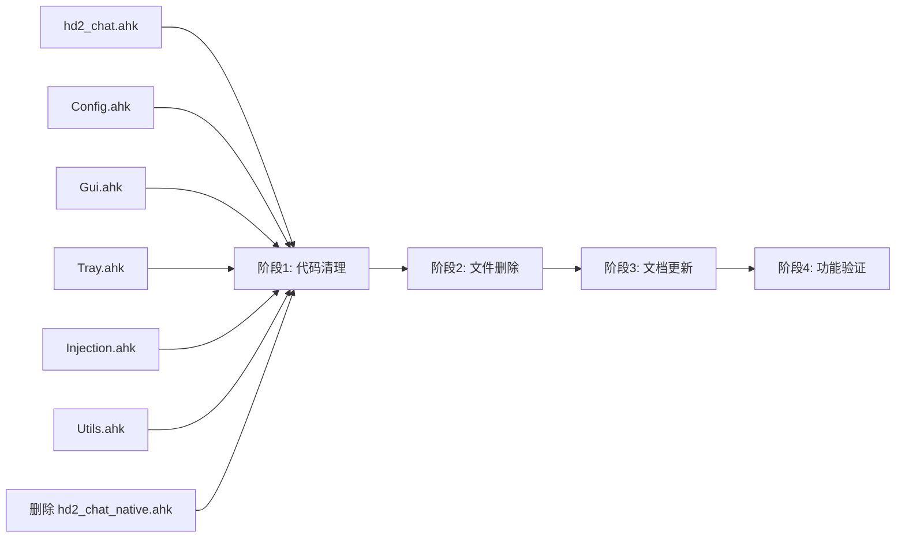

# HD2 Chat Overlay - WebView2 功能剔除实施计划

> **状态**: 已完成  
> **决策**: 彻底移除 WebView2 相关代码，回归纯 AHK 原生控件架构  
> **配置策略**: 完全移除 `UseWebView2` 配置项和 `[Engine]` INI 节

---

## 一、背景与决策

### 1.1 当前架构问题

项目当前为 **WebView2/原生双模式** 架构，存在以下问题：

| 问题 | 说明 |
|------|------|
| 代码复杂度高 | 所有 GUI 相关函数均有 WebView2/原生两个分支，维护困难 |
| 依赖外部组件 | WebView2 依赖 Edge Runtime、PowerShell HTTP 桥接服务器 |
| 稳定性风险 | WebView2 初始化失败需自动降级，逻辑复杂 |
| 资源占用 | 启动 Edge 进程 + HTTP 服务器，内存和启动时间增加 |

### 1.2 决策

**彻底移除 WebView2 相关代码**，回归纯 AHK 原生控件架构：

- 原生控件已验证稳定可靠，满足核心需求
- 代码量可减少约 40%，显著提升可维护性
- 消除外部依赖，降低部署复杂度
- Git 历史保留 WebView2 实现，未来如需可恢复

---

## 二、现状分析：WebView2 依赖清单

### 2.1 核心文件

| 文件 | 行数 | 职责 | 处理方式 |
|------|------|------|----------|
| [`lib/WebView2Host.ahk`](lib/WebView2Host.ahk:1) | 541 | WebView2 Runtime 检测、Edge App 宿主、HTTP 消息桥 | **删除** |
| [`lib/WebView2Bridge.ps1`](lib/WebView2Bridge.ps1:1) | 200 | PowerShell HTTP 桥接服务器 | **删除** |
| [`ui/overlay/index.html`](ui/overlay/index.html:1) | - | 悬浮窗 WebView2 前端 | **删除** |
| [`ui/overlay/overlay.css`](ui/overlay/overlay.css:1) | - | 悬浮窗样式 | **删除** |
| [`ui/overlay/overlay.js`](ui/overlay/overlay.js:1) | - | 悬浮窗交互逻辑 | **删除** |
| [`ui/config/index.html`](ui/config/index.html:1) | - | 配置窗口 WebView2 前端 | **删除** |
| [`ui/config/config.css`](ui/config/config.css:1) | - | 配置窗口样式 | **删除** |
| [`ui/config/config.js`](ui/config/config.js:1) | - | 配置窗口交互逻辑 | **删除** |
| [`hd2_chat_native.ahk`](hd2_chat_native.ahk:1) | 142 | 纯原生入口（与主入口重复） | **删除** |

### 2.2 需修改的 AHK 文件

| 文件 | WebView2 依赖点 |
|------|----------------|
| [`hd2_chat.ahk`](hd2_chat.ahk:1) | `#Include WebView2Host.ahk`、降级检查、引擎日志 |
| [`lib/Config.ahk`](lib/Config.ahk:1) | `UseWebView2` 配置项、`[Engine]` INI 读写 |
| [`lib/Gui.ahk`](lib/Gui.ahk:1) | `g_overlayHost`、WebView2 消息回调、配置窗口分支 |
| [`lib/Tray.ahk`](lib/Tray.ahk:1) | 引擎切换菜单、WebView2 状态显示、`WebView2Host.Shutdown()` |
| [`lib/Injection.ahk`](lib/Injection.ahk:1) | WebView2 `executeSubmit` 分支 |
| [`lib/Utils.ahk`](lib/Utils.ahk:1) | `UseWebView2` 高度判断 |

---

## 三、详细实施步骤

### 阶段 1：代码清理（6 个文件 + 1 个删除）

#### 1.1 修改 `hd2_chat.ahk`

**移除内容**：

```ahk
; 第 21 行：移除 WebView2Host 引用
#Include %A_ScriptDir%\lib\WebView2Host.ahk

; 第 38-43 行：移除 WebView2 降级检查
if (AppConfig.UseWebView2 && WebView2Host.ShouldFallback) {
    AppConfig.UseWebView2 := false
    AppConfig.Save()
    WriteLog("[Main] WebView2 连续初始化失败,已自动降级到原生模式")
}

; 第 174 行：修改启动日志，移除引擎信息
WriteLog("[Main] HD2 Chat Overlay v" SCRIPT_VERSION " 启动完成")
```

**修改后第 174 行**：
```ahk
WriteLog("[Main] HD2 Chat Overlay v" SCRIPT_VERSION " 启动完成")
```

---

#### 1.2 修改 `lib/Config.ahk`

**移除内容**：

```ahk
; 第 29 行：移除 UseWebView2 属性
static UseWebView2 := false

; 第 43 行：移除 INI 读取
this.UseWebView2 := this._ReadBool("Engine", "UseWebView2", false)

; 第 61 行：移除 INI 写入
IniWrite(this.UseWebView2 ? "1" : "0", this.iniPath, "Engine", "UseWebView2")

; 第 79 行：移除 ResetDefaults 中的重置
this.UseWebView2 := false
```

---

#### 1.3 修改 `lib/Gui.ahk`（改动最大）

**全局变量简化**：

```ahk
; 移除第 15 行
global g_overlayHost := ""    ; WebView2HostInstance 或 ""
```

**函数简化清单**：

| 函数 | 当前行数 | 修改方式 |
|------|---------|---------|
| [`InitChatGui()`](lib/Gui.ahk:20) | 20-53 | 移除 WebView2 分支，直接调用 `InitNativeChatGui()` |
| [`ShowChatGui()`](lib/Gui.ahk:58) | 58-132 | 移除 WebView2 分支，直接调用 `Native_ShowChatGui()` |
| [`HideGuiToOffscreen()`](lib/Gui.ahk:137) | 137-150 | 移除 `g_overlayHost` 判断，直接调用 `Native_HideGuiToOffscreen()` |
| [`GetInputText()`](lib/Gui.ahk:178) | 178-188 | 移除 `g_overlayHost` 分支，直接返回 `Native_GetText()` |
| [`ClearInput()`](lib/Gui.ahk:193) | 193-201 | 移除 `g_overlayHost` 分支，直接调用 `Native_ClearText()` |
| [`FocusInput()`](lib/Gui.ahk:206) | 206-215 | 移除 `g_overlayHost` 分支，直接调用 `Native_FocusEdit()` + `Native_SetEditCaret()` |
| [`GetIsChatActive()`](lib/Gui.ahk:220) | 220-228 | 移除 `g_overlayHost` 分支，直接返回 `Native_IsActive()` |
| [`SetIsChatActive()`](lib/Gui.ahk:233) | 233-241 | 移除 `g_overlayHost` 判断，直接调用 `Native_SetActive(state)` |
| [`GetChatGuiHwnd()`](lib/Gui.ahk:246) | 246-255 | 移除 `g_overlayHost` 分支，直接返回 `chatGui.Hwnd` |
| [`GetEditHwnd()`](lib/Gui.ahk:260) | 260-269 | 移除 `g_overlayHost` 分支，直接返回 `editBox.Hwnd` |
| [`RebuildChatGui()`](lib/Gui.ahk:274) | 274-294 | 移除 WebView2 重建分支，直接调用 `Native_RebuildChatGui()` |
| [`DestroyChatGui()`](lib/Gui.ahk:299) | 299-309 | 移除 `g_overlayHost` 分支，直接调用 `Native_DestroyChatGui()` |
| [`ShowConfigGui()`](lib/Gui.ahk:314) | 314-331 | 移除 WebView2 配置窗口分支，直接调用 `Native_ShowConfigGui()` |
| [`AdjustGuiPos()`](lib/Gui.ahk:519) | 519-548 | 移除 `g_overlayHost` 引用，统一使用 `nativeChatGui.Move()` |
| [`OnAdjustTimeout()`](lib/Gui.ahk:551) | 551-562 | 移除 `g_overlayHost` 引用，统一使用 `chatGui.Hwnd` |

**删除的 WebView2 消息回调函数**（第 336-512 行）：

- `_OnOverlaySubmit(payload)` — 悬浮窗提交
- `_OnOverlayCancel(payload)` — 悬浮窗取消
- `_OnOverlayReady(payload)` — 悬浮窗就绪
- `_OnOverlayResize(payload)` — 悬浮窗尺寸调整
- `_OnConfigGet(payload)` — 配置窗口获取配置
- `_OnConfigReset(payload)` — 配置窗口重置配置
- `_OnConfigSave(payload)` — 配置窗口保存配置
- `_OnConfigCancel(payload)` — 配置窗口取消
- `_OnConfigPreview(payload)` — 配置窗口预览

**简化后的 `InitChatGui()` 示例**：

```ahk
InitChatGui() {
    global chatGui, editBox

    WriteLog("[Gui] InitChatGui 开始")
    InitNativeChatGui()
    chatGui := nativeChatGui
    editBox := nativeEditBox
    WriteLog("[Gui] 原生悬浮窗已创建")
}
```

**简化后的 `ShowChatGui()` 示例**：

```ahk
ShowChatGui() {
    global isChatActive, lastShowTime, isBoundToGame, overlayInvokedWindow

    WriteLog("[Gui] ShowChatGui 被调用, isChatActive=" isChatActive)

    if (isChatActive || (A_TickCount - lastShowTime < 200)) {
        WriteLog("[Gui] 显示被跳过")
        return
    }

    try {
        overlayInvokedWindow := WinActive("A")
    } catch {
        overlayInvokedWindow := 0
    }

    isChatActive := true
    lastShowTime := A_TickCount
    SetCapsLockSafe("Off")
    try {
        IME_SET(1, "A")
    } catch {
    }

    Native_ShowChatGui()
}
```

---

#### 1.4 修改 `lib/Tray.ahk`

**移除内容**：

```ahk
; 第 10 行：移除引擎文本
engineText := AppConfig.UseWebView2 ? "WebView2" : "原生"

; 第 11-12 行：修改标题，移除引擎显示
A_TrayMenu.Add("HD2 Chat Overlay v" SCRIPT_VERSION, _TrayNoop)
A_TrayMenu.Disable("HD2 Chat Overlay v" SCRIPT_VERSION)

; 第 37-39 行：移除引擎切换菜单
engineSwitchText := AppConfig.UseWebView2 ? "🔧 切换到原生控件" : "🔧 切换到 WebView2"
A_TrayMenu.Add(engineSwitchText, _TrayToggleEngine)

; 第 53 行：修改托盘提示，移除引擎信息
A_IconTip := "HD2 Chat Overlay v" SCRIPT_VERSION "`n在游戏中按 Enter 唤醒输入框"

; 第 86-93 行：删除 _TrayToggleEngine 函数
_TrayToggleEngine(*) {
    AppConfig.UseWebView2 := !AppConfig.UseWebView2
    AppConfig.Save()
    engineText := AppConfig.UseWebView2 ? "WebView2" : "原生控件"
    TrayTip("引擎已切换", "已切换到 " engineText " 模式,脚本将重启", 1)
    Sleep(1500)
    Reload()
}

; 第 96 行：修改关于对话框，移除引擎信息
_TrayAbout(*) {
    MsgBox(
        "HD2 Chat Overlay v" SCRIPT_VERSION "`n`n"
        "《绝地潜兵 2》中文输入悬浮窗插件`n`n"
        "快捷键:`n"
        "  Enter - 唤醒输入框`n"
        "  Enter - 发送文本`n"
        "  Esc - 取消输入`n"
        "  Ctrl+Alt+方向键 - 调整窗口位置`n"
        "  滚轮/PgUp/PgDn - 滚动聊天记录`n`n"
        "配置保存于: hd2_chat_settings.ini",
        "关于 HD2 Chat Overlay",
        "Iconi"
    )
}

; 第 113-116 行：移除 WebView2Host.Shutdown()
_TrayExit(*) {
    ReleaseSingleInstance()
    ExitApp()
}
```

---

#### 1.5 修改 `lib/Injection.ahk`

**移除内容**：

```ahk
; 第 37-41 行：移除 WebView2 提交分支
if (g_overlayHost) {
    g_overlayHost.PostMessage('{"type":"executeSubmit"}')
    return
}
```

**简化后的 `SubmitText()`**：

```ahk
SubmitText(*) {
    global isChatActive
    if !isChatActive
        return

    isChatActive := false
    rawText := Native_GetText()
    Native_ClearText()

    HideGuiToOffscreen()

    gameHwnd := GetGameHwnd()
    targetHwnd := 0
    if (gameHwnd && WinActive("ahk_id " gameHwnd)) {
        targetHwnd := gameHwnd
    } else {
        global overlayInvokedWindow
        if (overlayInvokedWindow && WinExist("ahk_id " overlayInvokedWindow)) {
            targetHwnd := overlayInvokedWindow
        } else if (gameHwnd && WinExist("ahk_id " gameHwnd)) {
            targetHwnd := gameHwnd
        }
    }

    if (targetHwnd && WinExist("ahk_id " targetHwnd)) {
        try WinActivate("ahk_id " targetHwnd)
        if (rawText != "") {
            ReleaseModifiers()
            try IME_SET(0, "ahk_id " targetHwnd)
            SetCapsLockSafe("Off")
            sanitizedText := RegExReplace(rawText, "[\r\n]+", " ")
            SendOptimizedText(sanitizedText)
            Sleep(50)
            ReleaseModifiers()
            SendEvent("{Enter}")
            DisableGameIME()
        } else {
            ReleaseModifiers()
            SendEvent("{Enter}")
            DisableGameIME()
        }
    }
}
```

---

#### 1.6 修改 `lib/Utils.ahk`

**修改内容**：

```ahk
; 第 172-173 行：固定使用原生高度 50
if (guiHeight = 0)
    guiHeight := 50
```

---

#### 1.7 删除 `hd2_chat_native.ahk`

该文件与主入口功能完全重复，删除后由 `hd2_chat.ahk` 作为唯一入口。

---

### 阶段 2：文件删除（4 项）

| 操作 | 路径 | 说明 |
|------|------|------|
| 删除文件 | `lib/WebView2Host.ahk` | 541 行 WebView2 宿主逻辑 |
| 删除文件 | `lib/WebView2Bridge.ps1` | PowerShell HTTP 桥接服务器 |
| 删除目录 | `ui/overlay/` | 包含 `index.html`, `overlay.css`, `overlay.js` |
| 删除目录 | `ui/config/` | 包含 `index.html`, `config.css`, `config.js` |

---

### 阶段 3：文档更新

#### 3.1 更新 `plans/webview2-refactor-plan.md`

在文件顶部添加废弃标记：

```markdown
# HD2 Chat Overlay - WebView2 重构架构设计文档

> **⚠️ 已废弃**: 该计划已被回退，WebView2 相关功能已从代码库中移除。
> 项目当前采用纯 AHK 原生控件架构，详见 [`ahk-refactor-plan.md`](ahk-refactor-plan.md)。

---
```

#### 3.2 更新 `plans/ahk-refactor-plan.md`

在目标架构部分移除 WebView2 相关描述，确认当前为纯原生架构。

---

### 阶段 4：验证清单

实施完成后，按以下清单验证功能完整性：

#### 4.1 启动验证

- [ ] 脚本启动无 `#Include` 文件缺失错误
- [ ] 日志显示 `HD2 Chat Overlay v1.1.0 启动完成`（无引擎信息）
- [ ] 托盘菜单标题无引擎显示

#### 4.2 悬浮窗功能

- [ ] 按 Enter 唤醒原生悬浮窗
- [ ] 悬浮窗样式正确：暗色背景 `#0D0E12`、黄色左边条 `#FFC800`、💬 [中] 前缀
- [ ] 输入框可正常输入中文（IME 候选框正常）
- [ ] 按 Enter 提交文本到目标窗口
- [ ] 按 Esc 取消输入并隐藏悬浮窗

#### 4.3 配置窗口

- [ ] 托盘菜单"打开配置窗口"可正常打开
- [ ] 配置窗口显示所有配置项（OffsetX/Y、宽度、高度、字体大小、字间延迟、调试日志）
- [ ] 实时预览功能正常（修改配置时悬浮窗实时更新）
- [ ] 保存配置功能正常
- [ ] 取消/恢复默认功能正常

#### 4.4 热键功能

- [ ] Ctrl+Alt+方向键调整悬浮窗位置正常
- [ ] Shift+方向键调整悬浮窗位置正常
- [ ] Alt+方向键调整悬浮窗位置正常
- [ ] 滚轮/PgUp/PgDn 转发到游戏正常
- [ ] F12 重载脚本正常
- [ ] F9 强制显示悬浮窗正常

#### 4.5 托盘菜单

- [ ] 全局测试模式开关正常
- [ ] 配置回滚功能正常
- [ ] 关于对话框无引擎信息
- [ ] 退出功能正常（无 WebView2Host.Shutdown() 调用）

---

## 四、关键决策记录

| 决策点 | 选择 | 理由 |
|--------|------|------|
| 配置兼容性 | **彻底移除** `UseWebView2` 和 `[Engine]` INI 节 | 代码最简洁，旧配置中该字段被 `IniRead` 忽略不会报错 |
| `Gui.ahk` 处理方式 | **简化为纯原生路由**，保留门面模式 | 便于未来可能的引擎扩展，保持接口一致性 |
| `hd2_chat_native.ahk` | **删除** | 与主入口功能重复，单一入口降低维护成本 |
| WebView2 消息回调 | **全部删除** | 无前端后这些回调不再被触发，保留无意义 |

---

## 五、风险与缓解

| 风险 | 概率 | 缓解措施 |
|------|------|---------|
| 遗漏 WebView2 引用导致运行时错误 | 中 | 阶段 4 验证清单覆盖所有核心功能路径；全局搜索 `WebView2`、`g_overlayHost` 确认无残留 |
| 用户旧配置含 `[Engine]` 节 | 低 | AHK 的 `IniRead` 对不存在的键返回默认值，不会报错 |
| 原生模式 IME 输入卡顿 | 低 | 原生模式已长期验证，WebView2 主要解决的是极端长文本场景 |
| 未来需要重新引入 WebView2 | - | Git 历史保留所有 WebView2 代码，可通过 `git revert` 恢复 |

---

## 六、文件变更摘要

| 操作 | 文件 | 变更类型 | 预估代码变化 |
|------|------|---------|-------------|
| 修改 | `hd2_chat.ahk` | 删除 WebView2 相关代码 | -10 行 |
| 修改 | `lib/Config.ahk` | 删除 UseWebView2 配置 | -5 行 |
| 修改 | `lib/Gui.ahk` | 简化为纯原生路由，删除 WebView2 回调 | -200 行 |
| 修改 | `lib/Tray.ahk` | 删除引擎切换相关 | -30 行 |
| 修改 | `lib/Injection.ahk` | 删除 WebView2 提交分支 | -5 行 |
| 修改 | `lib/Utils.ahk` | 固定高度值 | -1 行 |
| 删除 | `hd2_chat_native.ahk` | 删除文件 | -142 行 |
| 删除 | `lib/WebView2Host.ahk` | 删除文件 | -541 行 |
| 删除 | `lib/WebView2Bridge.ps1` | 删除文件 | -200 行 |
| 删除 | `ui/overlay/` | 删除目录 | -3 文件 |
| 删除 | `ui/config/` | 删除目录 | -3 文件 |
| 修改 | `plans/webview2-refactor-plan.md` | 添加废弃标记 | +5 行 |
| 修改 | `plans/ahk-refactor-plan.md` | 更新架构描述 | -10 行 |

**总计**: 净减少约 **1130+ 行代码**，删除 **8 个文件/目录**。

---

## 七、实施顺序建议



**建议实施顺序**:

1. 先修改 `lib/Config.ahk`（移除配置项，后续文件依赖此变更）
2. 修改 `lib/Utils.ahk`（固定高度值）
3. 修改 `lib/Injection.ahk`（移除 WebView2 提交分支）
4. 修改 `lib/Tray.ahk`（移除引擎相关菜单和函数）
5. 修改 `lib/Gui.ahk`（改动最大，简化为纯原生路由）
6. 修改 `hd2_chat.ahk`（移除 #Include 和降级检查）
7. 删除 `hd2_chat_native.ahk`
8. 删除 `lib/WebView2Host.ahk`、`lib/WebView2Bridge.ps1`、`ui/overlay/`、`ui/config/`
9. 更新文档
10. 功能验证

---

*计划制定时间: 2026-07-30*  
*计划版本: 1.0*
